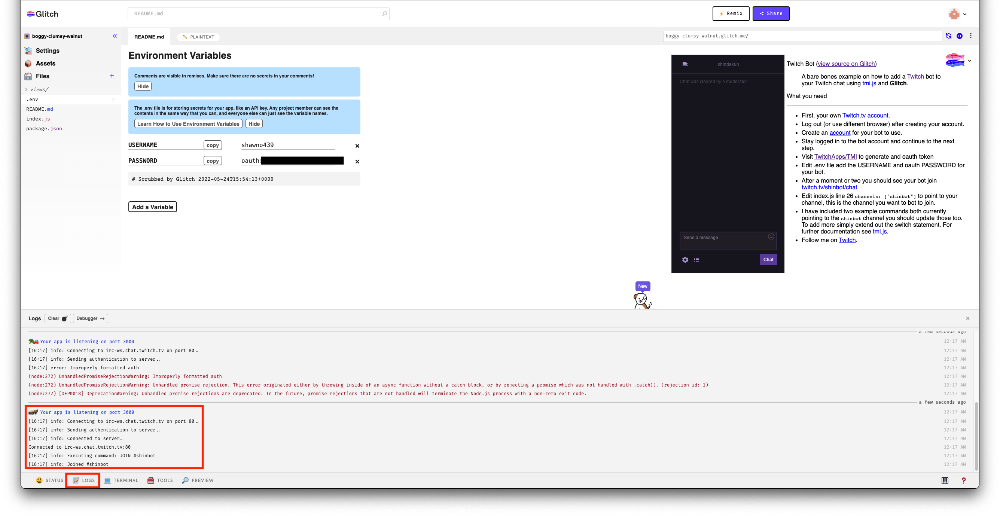

## 需備知識、工具

+ Glitch 帳號(可用Facebook、Github、Google帳號登入)
+ Javascript 基本語法
+ 已搭建完成機器人執行環境[可參考](https://jinwei0811.github.io/posts/TwitchBot/)

## Glitch

稍微介紹一下[Glitch](https://glitch.com/)，Glitch是一款很棒的線上工具，可以把很多東西都部署到上面。這邊截取一段官網的介紹「Glitch is the friendly place where everyone builds the `web`. Start a new `blog`, play with `React`, or build new worlds with `WebXR`.」，所以我們也可以把我們的Twitch發言機器人部署至上面，讓我們不用開機機器人也可以工作。  
但部署到Glitch有幾點要注意：  

1. 伺服器只要5分鐘內沒有觸發就會休眠(可用Call API的方式觸發)
2. 伺服器每12小時就會被關閉一次（需要手動打開）
3. 每個月有免費時數1000小時

## 將機器人部署上Glitch

1. 首先可以先參考去複製已存在的[範例專案](https://glitch.com/edit/#!/twitch-bot)。  
首先登入Glitch，再進去範例專案點擊右上角`Remix`。這時候需要讓Glitch執行一陣子，當執行完成會跳出README.MD的畫面。

點擊左上角Glitch，會在Projects裡看到你正在執行的專案。0小時的那個專案就是此次新建的專案。


2. 這時候再回到專案裡面，首先要進到Environment裡設定你Twitch帳號的相關認證。  
在 `USERNAME` 填入說話機器人的帳號  
在 `PASSWORD` 輸入從twitch取回的 `oauth:my_bot_token`  
(可參考[第一篇文章](https://jinwei0811.github.io/posts/TwitchBot/)第5點)


3. 當一切設定好後點擊下方Log，則可以看到機器人人已成功連結至Twitch聊天室。


4. 設定呼叫API  
點擊畫面左邊的 `index.json` 到輸入機器人指令的地方，將程式碼拉到最下面新增Function。  
這個Function就是設定一個RestAPI，當被呼叫的時候就會印出`i'm awake` 以及回傳 `i'm awake` 。

```
app.get("/wakeup", function (request, response) {
  console.log("i'm awake");
  response.send("i'm awake");
});
```

5. 設定每4.5分鐘呼叫一次  
Glitch非常有趣，可以自己呼叫自己XD，所以當我們成功添加上面的Function，只要每5分鐘內呼叫一次，這樣子伺服器就不會休眠。  
在剛才新增的Function下面新增Function，其中`https://xxxxx-xxxxx-xxxxx.glitch.me` 需要置換成你自己專案的URL，最快的取得方式是，直接點擊CopyLink，覆蓋掉就可以了。（如果預覽視窗沒有出現，也可以點擊下方的Preview叫出預覽視窗)

```
setInterval(() => {
  fetch("https://xxxxx-xxxxx-xxxxx.glitch.me/wakeup", {
    method: "GET",
  });
}, 270000);
```


## 注意事項

1. 記得設定`channels` 將他指到機器人要加入的聊天室。
2. 如果有用到其他 `node.js module` 請先至 `package.json` 新增，並在`Terminal`輸入  

```

   npm install

 ```

3. 要新增機器人執行指令請加在 `index.json` 裡面。  

到這邊應該可以成功的將機器人部署到Glitch上了，只要記得12小時內開一次Glitch專案的網頁，就可以重新連上去，可以開始設定你的機器人了！
